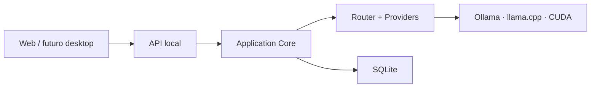

# JARBAS — Personal Cognitive R&D OS

Um sistema operacional pessoal de P&D que transforma ideias dispersas em projetos concluídos, preserva decisões, encontra conexões e recomenda o próximo experimento com evidências.

> Lembrar sem vigiar. Orientar sem mandar. Conectar sem inventar. Melhorar sem explorar.

## O que torna este projeto diferente

O produto não tenta vencer assistentes generalistas em conversa, voz ou quantidade de integrações. Sua unidade central é o **Project Object**: um registro vivo do objetivo, hipóteses, decisões, evidências, experimentos, artefatos, bloqueios e próxima ação de cada projeto.

O loop principal é:

```text
ideia → hipótese → pesquisa → decisão → experimento → resultado → aprendizado
```

## Foundation executável

A Foundation V1 agora contém:

- API HTTP local vinculada a `127.0.0.1`;
- interface web com streaming e cancelamento;
- abstrações de modelo/runtime e provider OpenAI-compatible;
- Model Router configurável e provider determinístico de desenvolvimento;
- SQLite com migrations, sessões, mensagens e métricas;
- health checks separados para aplicação, storage, runtime e modelo;
- logs JSON com redação e sem conteúdo de conversa;
- presets AMD atual e NVIDIA futuro.

## Produto-alvo

- Project Memory com origem, confiança e correção.
- Decision Ledger com alternativas e motivos.
- Next Best Experiment para reduzir a maior incerteza.
- Weekly Review e radar de projetos esquecidos.
- Connection Engine com explicações, não apenas similaridade.
- Policy Engine para que ações sejam explícitas, limitadas e auditáveis.

Ficam fora do MVP: captura contínua de tela/microfone, shell arbitrário, compras, envio autônomo de mensagens, exclusão permanente, hardware próprio e avatar cinematográfico.

## Arquitetura

Começamos como um **monólito modular local-first**. O LLM propõe; componentes determinísticos validam e executam.



Veja a [Model & AI Stack Review #001](docs/research/model-ai-stack-review-001.md), [arquitetura](docs/architecture/overview.md), [roadmap](docs/product/roadmap.md), [segurança](docs/security/threat-model.md) e [Project Discovery Meeting #001](docs/research/discovery-meeting-001.md).

## Estrutura

```text
apps/api/             API local e servidor da interface
apps/web/             interface web sem lógica cognitiva
configs/              runtimes, modelos, hardware e privacidade
packages/contracts/   contratos tipados e estáveis
packages/application/ orquestração do caso de uso de chat
packages/config/      carregamento e validação de configuração
packages/llm/         providers local/mock/OpenAI-compatible
packages/routing/     Model Router determinístico
packages/storage/     SQLite, migrations e sessões
packages/observability/ logs estruturados e redação
packages/domain/      regras de projetos, decisões e memória
packages/security/    política determinística de ações
docs/                 produto, arquitetura, ciência, segurança e ADRs
```

## Qualidade

O pedido de revisar o código mais de duas vezes virou três gates verificáveis:

1. Estático: formatação, lint e TypeScript strict.
2. Comportamental: testes de domínio, contratos e integração.
3. Crítico: revisão de segurança, avaliações de IA e revisão humana antes do merge.

```bash
corepack enable
pnpm install
pnpm check
pnpm build
```

### Executar com Ollama local

```bash
ollama pull qwen3.5:4b
pnpm build
pnpm start
```

Abra `http://127.0.0.1:8787`. Para validar sem pesos:

```bash
JARBAS_PROVIDER=mock-local pnpm start
```

Configurações locais podem usar variáveis de ambiente como `JARBAS_PROVIDER`, `JARBAS_PRESET`, `JARBAS_DATABASE_PATH`, `JARBAS_SERVER_HOST` e `JARBAS_SERVER_PORT`.

## Estado atual

**DONE:** contratos, domínio inicial, Policy Engine e Foundation de chat local.

**NEXT:** memória persistente auditável.
**BLOCKED:** benchmark real de GPU/modelos precisa ser executado no hardware do usuário.
