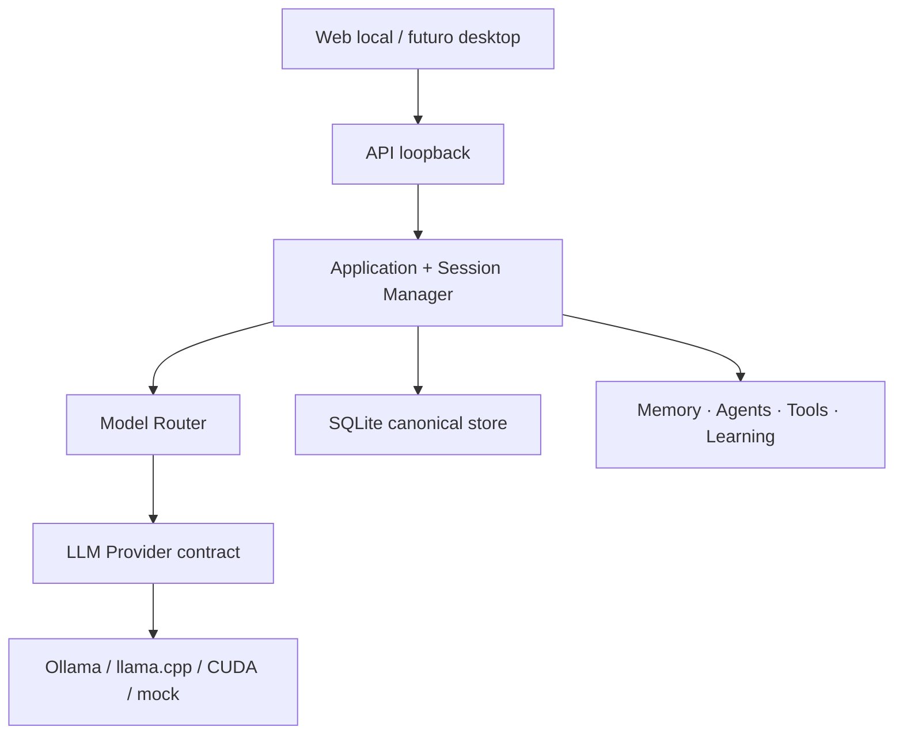

# MODEL & AI STACK REVIEW #001

**Status:** decisão de fundação aprovada; seleção final de modelos condicionada a benchmark local  
**Pesquisa realizada:** 2026-09-03  
**Escopo:** Phase 0.5 e Foundation V1

## Resultado executivo

A equipe decidiu construir um monólito modular TypeScript, local-first e API-first. O núcleo conhece contratos de modelo e capacidades, mas não conhece CUDA, ROCm, Vulkan, Ollama ou llama.cpp. A configuração seleciona o runtime e resolve o artefato correspondente.

O primeiro baseline executável usa API HTTP local, interface web estática, streaming, SQLite, sessões persistentes, métricas e health checks separados. Um provider determinístico permite desenvolver e testar sem baixar pesos. Ollama e llama.cpp entram por uma API OpenAI-compatible.

Nenhum LLM recebeu o estado `STABLE`. Todos permanecem `CANDIDATE / NOT BENCHMARKED LOCALLY` até execução na máquina informada pelo usuário.

## Participantes e posições

| Perspectiva | Conclusão objetiva |
| --- | --- |
| Arquitetura | Dependency inversion entre domínio, modelo, runtime e interface. |
| AI/LLM | Qwen3.5 4B/9B e Ministral 3 8B formam a primeira shortlist; medir antes de promover. |
| GPU/Performance | Não confundir suporte nominal com funcionamento na RX 9060 XT; comparar ROCm e Vulkan. |
| Backend | API loopback, streaming NDJSON e SQLite são suficientes para Foundation V1. |
| Dados | SQLite é canônico; busca vetorial e grafo começam como projeções substituíveis. |
| Segurança/Privacidade | Offline por padrão, conteúdo fora dos logs e origem web restrita. |
| UX/Produto | Web local primeiro; desktop empacotado depois de estabilizar contratos. |
| QA/MLOps | Provider mock, golden cases e benchmark versionado antes de fine-tuning. |
| Revisor crítico | Evitar framework multiagente, graph DB, vector DB e treinamento automático prematuros. |

## 1. System requirements atualizado

### Funcionais da Foundation V1

- iniciar em loopback;
- selecionar provider, runtime e preset por configuração;
- criar uma sessão e persistir mensagens;
- conversar por streaming;
- manter identidade do modelo separada do backend de execução;
- registrar rota, modelo, runtime, latência e estado sem registrar o conteúdo;
- expor saúde de aplicação, storage, runtime e modelo separadamente;
- trocar AMD por NVIDIA apenas pela infraestrutura/configuração;
- operar com provider determinístico quando o runtime real estiver indisponível.

### Não funcionais

- TypeScript strict, módulos pequenos e contratos explícitos;
- bind somente em `127.0.0.1`, `localhost` ou `::1` na V1;
- nenhum segredo em código, JSON versionado ou logs;
- banco com migrations e transações;
- configuração inválida deve falhar de modo explícito;
- cancelamento, timeout, erro recuperável e fallback nunca silencioso;
- testes de unidade, persistência, integração HTTP, SSE e segurança.

## 2. Perfis de hardware

| Perfil | Hardware | Objetivo | Estado desta revisão |
| --- | --- | --- | --- |
| AMD Current | Ryzen 5 9600X, RX 9060 XT 16 GB, 32 GB RAM, NVMe 2 TB | inferência diária e benchmark ROCm/Vulkan | hardware declarado; **NOT BENCHMARKED LOCALLY** |
| NVIDIA Future | Ryzen 7 9800X3D, RTX 5070 Ti 16 GB, 32 GB RAM, mesmo NVMe | CUDA, maior previsibilidade de ML e fine-tuning eficiente | planejado; **NOT BENCHMARKED LOCALLY** |
| CI atual | VM Ubuntu, sem GPU/runtimes locais disponíveis | contratos, storage, API e testes determinísticos | foundation validada; não representa o PC do usuário |

A VRAM é igual nas duas fases. O ganho esperado da troca não autoriza aumentar modelo/contexto automaticamente: o benchmark deve avaliar throughput, TTFT, estabilidade e espaço restante para embeddings/agentes.

## 3. Sistema operacional

| Opção | AMD agora | NVIDIA depois | ML/containers | Custo operacional | Decisão |
| --- | --- | --- | --- | --- | --- |
| Windows 11 | suporte oficial Radeon/ROCm limitado, boa experiência desktop | CUDA disponível | médio | baixo | baseline diário |
| WSL2 + Ubuntu 24.04 | RX 9060 XT listada pela AMD | bom caminho CUDA | alto | médio | ambiente opcional |
| Ubuntu 24.04 nativo | melhor previsibilidade Linux | melhor para CUDA/vLLM/treino | muito alto | médio | baseline de treino/performance |
| Dual boot | combina UX Windows e ML Linux | combina ambos | alto | alto | opcional se WSL2 limitar benchmark |
| Windows 10 | não aparece no suporte oficial atual consultado | legado | baixo | crescente | não recomendado |

**Decisão:** Windows 11 como `DEVELOPMENT_BASELINE`; Ubuntu 24.04 LTS nativo como `TRAINING_BASELINE`; WSL2 Ubuntu 24.04 como `OPTIONAL_ENVIRONMENT`. Se a máquina ainda estiver em Windows 10, atualizar antes de tratar ROCm/PyTorch como caminho suportado.

Fontes: [AMD ROCm on Radeon — Windows support matrix](https://rocm.docs.amd.com/projects/radeon-ryzen/en/latest/docs/compatibility/compatibilityrad/windows/windows_compatibility.html), [AMD ROCm on Radeon — WSL support matrix](https://rocm.docs.amd.com/projects/radeon-ryzen/en/latest/docs/compatibility/compatibilityrad/wsl/wsl_compatibility.html).

## 4. Runtime review

| Runtime | AMD | NVIDIA | Windows | Linux | Força | Risco/limitação |
| --- | --- | --- | --- | --- | --- | --- |
| Ollama | ROCm/Vulkan conforme plataforma | CUDA | sim | sim | instalação e API simples | abstrai detalhes; desempenho precisa ser medido |
| llama.cpp | HIP/Vulkan | CUDA/Vulkan | sim | sim | controle, GGUF, fallback CPU/GPU | configuração e templates variam |
| vLLM | ROCm em GPUs suportadas | CUDA | não nativo | sim | throughput/concurrency | complexidade excessiva para usuário único inicial |
| PyTorch direto | ROCm | CUDA | limitado por matriz | sim | treino e controle fino | dependências e compatibilidade mais frágeis |
| ONNX/DirectML | possível | possível | sim | parcial | portabilidade para modelos compatíveis | não é baseline de LLM generativo geral |

**Phase A:** integrar Ollama por API e comparar Ollama ROCm, Ollama Vulkan e llama.cpp Vulkan/HIP. Backend configurado como `auto` até o detector confirmar o caminho efetivo. Fallback CPU precisa aparecer como degradação, nunca como sucesso silencioso.

**Phase B:** manter o contrato e trocar o runtime configurado para CUDA. Avaliar vLLM somente se concorrência/throughput justificar serviço Linux dedicado.

Fontes: [Ollama GPU support](https://docs.ollama.com/gpu), [llama.cpp](https://github.com/ggml-org/llama.cpp), [vLLM GPU installation](https://docs.vllm.ai/en/stable/getting_started/installation/gpu/).

## 5. Model shortlist

As notas abaixo são de triagem documental, não resultado local.

| Papel | Candidato | Quantização inicial | Contexto inicial | Motivo | Estado |
| --- | --- | --- | --- | --- | --- |
| FAST | Qwen3.5 4B | Q4_K_M | 16K | latência e extração estruturada | NOT BENCHMARKED LOCALLY |
| PRIMARY | Qwen3.5 9B | Q4_K_M | 32K | português, código, tools e multimodalidade | NOT BENCHMARKED LOCALLY |
| REASONING | Qwen3.5 9B thinking | Q4_K_M | 32K | compartilhar pesos com primary | NOT BENCHMARKED LOCALLY |
| REASONING control | Ministral 3 8B | Q4_K_M | 32K | JSON/function calling e licença Apache-2.0 | NOT BENCHMARKED LOCALLY |
| CODING | Qwen3.5 9B | Q4_K_M | 32K | evitar modelo adicional antes de provar ganho | NOT BENCHMARKED LOCALLY |
| EMBEDDING | Qwen3 Embedding 0.6B | medir FP16/Q8 | 8K por padrão | multilingual + code, pequeno | NOT BENCHMARKED LOCALLY |
| EMBEDDING controls | EmbeddingGemma 308M, BGE-M3 | conforme runtime | benchmark | comparar recall PT/EN/código | NOT BENCHMARKED LOCALLY |
| RERANKER | Qwen3 Reranker 0.6B | desativado na V1 | n/a | só entra se elevar nDCG/Recall | NOT BENCHMARKED LOCALLY |
| VISION futuro | Qwen3.5 9B; Gemma 4 12B | medir | 16K–32K | imagem/documentos | PLANNED |

Fontes primárias: [Qwen3.5 4B](https://huggingface.co/Qwen/Qwen3.5-4B), [Qwen3.5 9B](https://huggingface.co/Qwen/Qwen3.5-9B), [Ministral 3 8B](https://huggingface.co/mistralai/Ministral-3-8B-Instruct-2512), [Qwen3 Embedding](https://huggingface.co/Qwen/Qwen3-Embedding-0.6B), [Qwen3 Reranker](https://huggingface.co/Qwen/Qwen3-Reranker-0.6B), [BGE-M3](https://huggingface.co/BAAI/bge-m3), [EmbeddingGemma](https://ai.google.dev/gemma/docs/embeddinggemma), [Gemma 4](https://ai.google.dev/gemma/docs/core/model_card_4).

## 6. Plano de benchmark local

Cada combinação é uma unidade versionada: modelo + checksum + quantização + runtime + versão + driver + backend + contexto + preset.

Medições mínimas:

1. carga fria e quente;
2. TTFT, tokens/s, duração, RAM e VRAM;
3. português, código, raciocínio e sumarização;
4. JSON válido e aderência a schema;
5. seleção de ferramenta e resistência a prompt injection;
6. 8K/16K/32K de contexto, sem assumir o máximo documental;
7. cinco repetições após aquecimento;
8. temperatura zero para regressão e configuração realista para UX.

Gates iniciais: zero falha crítica de privacidade/tool use, JSON válido ≥ 98% nos golden cases, ausência de regressão material no benchmark pessoal e experiência interativa aceitável. Thresholds finais serão definidos após obter a distribuição real.

## 7. Dados, vector store e Knowledge Graph

| Decisão | Foundation V1 | Próximo benchmark | Gatilho para evoluir |
| --- | --- | --- | --- |
| Relacional | SQLite | PostgreSQL | sync multiusuário/concurrency comprovada |
| Keyword search | SQLite FTS5 | BM25 externo | recall insuficiente |
| Vector | adapter, sem DB dedicado | extensão SQLite vs LanceDB vs Qdrant | corpus/filters/latência exigirem |
| Knowledge Graph | nós/arestas em tabelas SQLite | graph embedded/Neo4j | consultas multi-hop justificarem operação extra |
| Reranking | desligado | Qwen3 Reranker vs sem reranker | ganho estatisticamente útil |

SQLite permanece fonte canônica; índice vetorial e grafo são projeções reconstruíveis. Isso evita três bancos antes de existir carga real.

## 8. Agentes, ferramentas e interface

**Framework de agentes:** nenhum na Foundation. Um orchestrator determinístico com contratos explícitos é mais auditável. Framework será reavaliado somente quando loops, checkpoints e fan-out reais superarem a implementação simples.

**Primeiras ferramentas recomendadas:** filesystem read-only, document ingest/read e web/search read-only. Terminal e GitHub com escrita entram depois do `ToolRegistry + PolicyEngine + confirmation + receipt` estar integrado.

**Interface:** web local servida pela própria API nativa Node. CLI será diagnóstica. React/Tauri continuam possíveis porque a UI não contém lógica cognitiva. A escolha nativa remove dependências prematuras e mantém streaming/cancelamento verificáveis.

Projetos de validação:

1. desenvolvimento do próprio JARBAS;
2. migração AMD → NVIDIA;
3. oficina/impressão 3D Bambu P2S;
4. produção musical e lançamento;
5. portfólio de ideias/produtos, após memória e conexões.

## 9. External Data Policy e segurança inicial

| Classe | Padrão | Saída externa |
| --- | --- | --- |
| PUBLIC | allow | permitida |
| PERSONAL | confirm + minimize | somente após confirmação/política específica |
| PRIVATE | confirm + minimize/redact | somente após confirmação explícita |
| SECRET | deny | nunca |
| RESTRICTED | deny | nunca |

Controles implementados: loopback obrigatório, allowlist de Origin, CSP, limites de body/mensagem, timeouts de provider, sem conteúdo em logs, redação de credenciais, nenhum segredo versionado e health detalhado. Pendências: autenticação local para exposição além do loopback, criptografia de dados em repouso, sandbox e consent receipts.

## 10. Fine-tuning e migração

Memória pessoal será storage/RAG, não fine-tuning. A Phase A implementará coleta, privacidade, versionamento e evaluation antes de qualquer treino automático. QLoRA/LoRA são os primeiros experimentos previstos; DPO/preference optimization só após pares de preferência de qualidade. Full fine-tuning doméstico não é baseline.

Checklist da troca para RTX 5070 Ti:

1. inventariar Windows/Ubuntu, driver e CUDA;
2. selecionar runtime CUDA apenas em configuração;
3. executar os mesmos golden cases da AMD;
4. comparar TTFT, tokens/s, VRAM, estabilidade e energia;
5. reavaliar quantização/contexto, sem promoção automática;
6. habilitar treino experimental em branch;
7. registrar ADR revisada e Hardware Profile medido.

## 11. Arquitetura aprovada

## 12. Roadmap atualizado

- **NOW — Foundation V1:** config, runtime/provider, router, API/UI, SQLite, streaming, health, observabilidade, CI.
- **NEXT — Persistent Memory:** memory schema, provenance, user control, restart tests.
- **NEXT — Retrieval:** embeddings benchmark, hybrid search, ranking and contradiction detection.
- **LATER:** graph, agent orchestrator, ToolRegistry executors, learning collector, evaluation registry.
- **RESEARCH:** AMD runtime benchmarks, embedding/reranker selection, STT/TTS, QLoRA after NVIDIA.
- **BLOCKED:** local GPU results in this environment; must run on the user hardware.

## Argumento crítico final

O risco dominante não é escolher “o segundo melhor modelo”; é construir um núcleo acoplado a um backend instável, armazenar inferências como fatos ou automatizar ferramentas/treino antes de avaliação. Esta revisão deliberadamente mantém modelos como candidatos e entrega infraestrutura mensurável primeiro.
